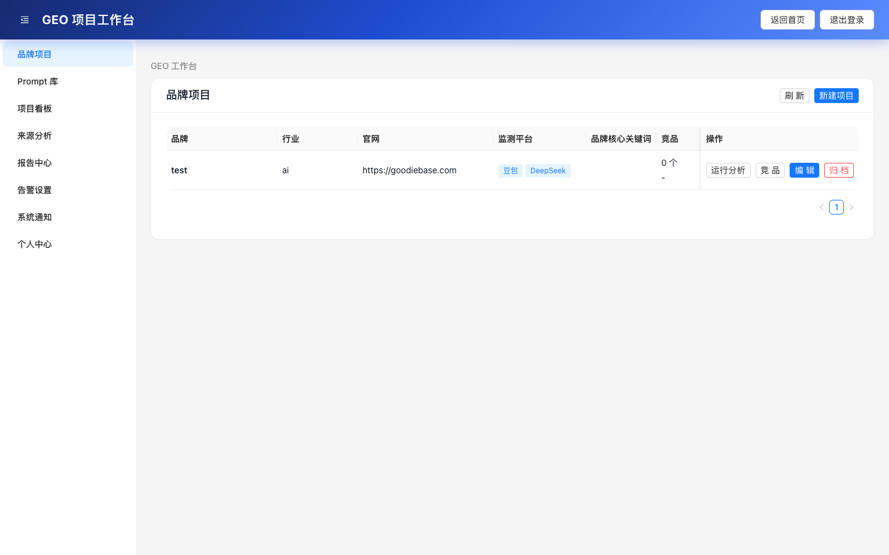
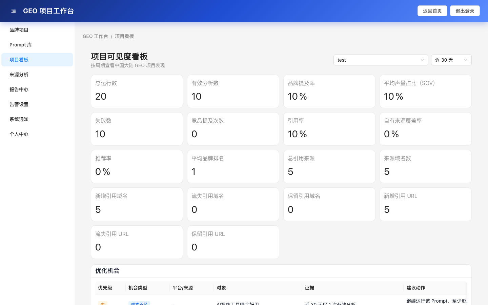
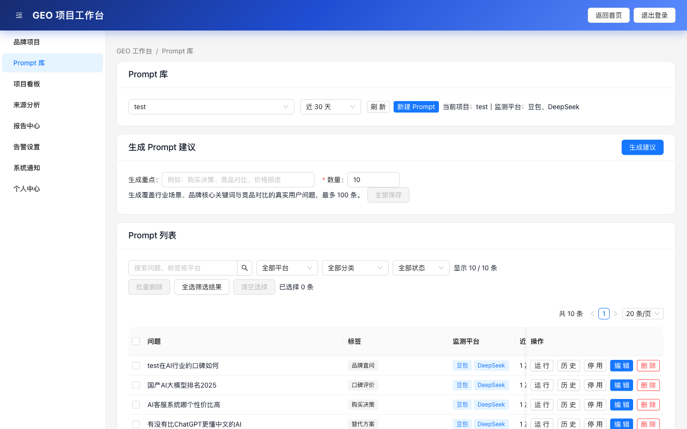

# GoodieAI GEO Monitoring System

GoodieAI GEO Monitoring System 是一个面向 Generative Engine Optimization（GEO）的监测系统，用于观察品牌在 AI 搜索、AI 问答和大模型回答中的曝光、提及、推荐与引用来源表现。

## 系统演示

### 品牌项目工作台


### 项目可见度看板


### Prompt 库管理


## 核心功能

- 品牌项目创建、归档、恢复与删除
- GEO 检测任务创建、调度与执行记录
- 多平台 AI 回答结果监测，当前重点支持豆包、DeepSeek
- 豆包联网搜索调用与引用来源提取
- 品牌提及率、Share of Voice、引用率、竞品曝光分析
- Prompt 库管理、分类、平台选择与历史结果追踪
- 引用来源按自有来源、竞品来源、第三方来源聚合分析
- 用户登录、权限、会员等级与额度管理
- 管理后台：用户、任务、会员、系统配置与运行记录管理
- 本地 SQLite 自动初始化，生产环境支持外部 Postgres 数据库

## 适用场景

- 品牌在 AI 搜索结果中的可见性监测
- GEO / AEO / AI Search Optimization 数据分析
- 生成式搜索引擎中的竞品曝光研究
- AI 平台回答内容与引用来源的长期追踪
- Prompt 表现、平台差异与优化机会分析

## 当前架构

- 前端：Next.js，目录为 `nextjs-frontend/`
- 后端：Node.js + Express，目录为 `backend/`
- 数据库：本地默认 SQLite；生产环境可通过 `DATABASE_URL` 使用外部 Postgres
- 部署方式：支持前后端分离部署，也可以部署到自有服务器或支持 Node.js 常驻服务的平台
- API 访问：前端可通过 `/api/*` 代理到后端服务

## 快速开始

首次安装依赖：

```bash
npm install
cd backend && npm install
cd ../nextjs-frontend && npm install
```

创建本地环境变量文件：

```bash
cp backend/.env.example backend/.env
cp nextjs-frontend/.env.example nextjs-frontend/.env.local
```

然后编辑 `backend/.env`，至少填写：

- `JWT_SECRET`
- `DEFAULT_ADMIN_PASSWORD`
- 需要启用的平台 API Key，例如 `DOUBAO_API_KEY`、`DEEPSEEK_API_KEY`

生产环境还应配置 `ALLOWED_ORIGINS`，并通过环境变量注入 `DATABASE_URL`、AI 平台密钥等敏感配置。

统一启动前后端：

```bash
npm run dev
```

默认地址：

- 前端：`http://localhost:3001`
- 后端：`http://localhost:3002`
- 健康检查：`http://localhost:3002/api/health`

## 常用命令

```bash
npm run dev          # 同时启动后端和 Next.js 前端
npm run dev:backend  # 只启动后端
npm run dev:frontend # 只启动前端
npm run build        # 构建 Next.js 前端
npm run lint         # 检查 Next.js 前端
```

后端测试：

```bash
cd backend
npm test
```

## 生产部署

生产环境建议：

- 前端和后端可以分离部署，也可以由同一台服务器反向代理
- 后端需要运行在支持常驻 Node.js 进程的环境中
- 数据库建议使用外部 Postgres，并通过 `DATABASE_URL` 配置
- 前端如需同域调用后端 API，可配置 `API_BASE_URL` 作为代理目标

后端生产环境必须配置强随机 `JWT_SECRET`、生产域名白名单 `ALLOWED_ORIGINS`、`DATABASE_URL` 和实际使用的 AI 平台密钥。不要把真实配置文件、访问令牌、数据库连接串或 API Key 提交到仓库。

更多部署细节见 [部署与运维](docs/DEPLOYMENT.md)。

## 默认账号

- 管理员用户名默认由 `backend/.env` 中的 `DEFAULT_ADMIN_USERNAME` 控制
- 管理员初始密码由 `backend/.env` 中的 `DEFAULT_ADMIN_PASSWORD` 控制
- 生产环境部署后必须立即修改默认管理员密码

不要在 README、Issue、提交记录或聊天记录中公开生产账号、密码、JWT、API Key、数据库连接串等敏感信息。

## 文档

- [文档总览](docs/README.md)
- [接口文档](docs/API.md)
- [环境变量](docs/ENVIRONMENT.md)
- [部署与运维](docs/DEPLOYMENT.md)
- [安全加固说明](docs/SECURITY.md)
